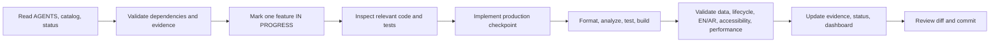

# CARGame Executive Implementation Plan

## Objective

Transform the existing Flutter project into a production-quality global cargo sorting game with 150 levels, 6 worlds, 25 cities per world, premium 3D-rendered visuals, a living motion system, safe offline-first progress/economy, Arabic/English support, measurable quality, privacy/security/legal readiness, and sustainable Android release operations.

## Delivery approach

Codex executes one coherent catalog feature or tightly coupled checkpoint at a time:

## Mandatory workstreams

### 1. Foundation and governance

- Repository baseline, architecture boundaries, persistence migrations, startup resilience, diagnostics, dependencies, environments, secret handling, CI, clean-machine developer tooling, and offline service isolation.
- Versioned analytics schema and privacy-gated crash/non-fatal diagnostics.

### 2. Premium 3D presentation and assets

- Shared 3D tokens/components, responsive states, loading/error/retry patterns, optimized WebP registry, fallbacks, precaching, production product/world/reward packs, provenance, licensing, and automated asset validation.

### 3. Living motion, audio, and haptics

- Shared motion tokens, immediate interactions, guarded transitions, gameplay causality, reward motion, interruption/background safety, reduced motion, licensed audio, loudness rules, settings, and synchronized haptics.

### 4. Gameplay, content, and progression

- Deterministic input/state machine, interruption recovery, 3D board/products, 150 versioned/validated levels, quantitative difficulty, six distinct bosses, content migrations, reward ledger, economy configuration, atomic shop/progress/achievement flows.

### 5. Retention, live operations, and monetization

- Daily/weekly systems, streaks, chests, events, clock safeguards, safe cached live configuration, opt-in notifications, optional social/cloud/billing boundaries, consent-aware ads, pacing, quality analytics, and no-fill fallback.

### 6. Localization and accessibility

- EN/AR ARB coverage, RTL/LTR, locale-aware formatting, fonts/plurals/bidi, translation QA/fallback, semantics, screen reader, large text, contrast, focus, touch targets, non-color cues, and accessibility statement.

### 7. Performance, reliability, and quality gates

- Frame/memory/startup/app-size/network/battery budgets, low-end mode, runtime/storage recovery, dynamic device/build scripts, unit/widget/golden/integration tests, device/API matrix, dashboard parser, privacy/security tests, release smoke/soak tests.

### 8. Privacy, security, legal, release, and operations

- Data inventory/minimization/deletion, privacy policy and Play Data safety, threat model, secret/dependency/artifact scans, app hardening, open-source and content-rights notices, signing/key management, APK/AAB, listings, testing tracks, production monitoring, rollback, release archive, and go/no-go ownership.

## Mandatory engineering constraints

- Never hard-code a device, emulator, local SDK path, secret, keystore, production ad ID, or analytics credential.
- Never use animation to mask slow work or grant state from animation callbacks without domain idempotency.
- Never accept gameplay input while resolving or execute route/reward/purchase/ad callbacks twice.
- Never make ads, analytics, crash reporting, logging, orientation, remote config, notifications, or network services block startup/core play.
- Never change storage/content/economy schemas without versioning, migration, compatibility tests, and rollback/recovery behavior.
- Never ship an asset/audio/font/SDK without documented rights, license, and privacy implications.
- Never collect analytics or personalized advertising data before the applicable consent/config gate.
- Never mark work `VERIFIED` without measurable acceptance evidence and applicable checks.

## Definition of done

A catalog feature is complete only when it is integrated into the real flow; handles loading/empty/error/retry/offline/interruption states; preserves saved data; guards asynchronous races; considers EN/AR, accessibility, responsive layouts, motion lifecycle, performance, privacy/security/legal impact; adds practical tests; passes applicable verification; updates documentation/status/dashboard; and has one coherent reviewed commit.

A phase is complete only when every required non-deferred task in its catalog section is `VERIFIED`.

## Verification tiers

1. **Code gate:** format, analyze, unit/widget tests.
2. **Android gate:** debug build and relevant device/API smoke test.
3. **Release gate:** signed candidate APK/AAB, privacy/security/legal checks, smoke/soak matrix, monitoring/rollback readiness.
4. **External blocker:** recorded as `BLOCKED`, never reported as passed.

## Codex response contract

Return only completed work, feature status changes, changed files, verification, dashboard validation, blockers, and commit SHA. Do not paste full files, repeat the roadmap, or ask questions for non-blocking decisions.
