# CARGame Executive Implementation Plan

## Objective

Transform the existing Flutter project into a production-quality global cargo sorting game with:

- 150 playable levels.
- 6 worlds.
- 25 cities per world.
- A unified stylized 3D-rendered visual language.
- Responsive animation that makes the application feel alive.
- Stable offline-first progress and economy.
- Arabic RTL and English LTR.
- Android APK and AAB release readiness.

## Delivery approach

Codex executes one coherent phase at a time. Every phase follows the same loop:

```mermaid
flowchart LR
    A[Read AGENTS and STATUS] --> B[Inspect relevant code only]
    B --> C[Implement one coherent phase]
    C --> D[Format]
    D --> E[Analyze]
    E --> F[Test]
    F --> G[Android build when applicable]
    G --> H[Fix regressions]
    H --> I[Update docs and STATUS]
    I --> J[Commit checkpoint]
    J --> K[Continue next incomplete phase]
```

## Workstreams

### A. Foundation

- Audit repository and establish a reproducible baseline.
- Consolidate architecture and scripts.
- Protect persistent storage compatibility.
- Establish design, motion, asset, level, and test documentation.

### B. Premium 3D presentation

- Build shared 3D UI primitives.
- Replace primary flat icons and emoji placeholders.
- Integrate optimized transparent WebP assets.
- Ensure consistent lighting, perspective, materials, shadows, and scale.

### C. Live motion experience

- Build shared motion tokens and reusable effects.
- Add immediate tap feedback.
- Add route, reward, progress, selection, gameplay, and ambient animation.
- Couple motion with sound and haptics.
- Support reduced motion and low-performance modes.

### D. Gameplay and content

- Harden the gameplay state machine.
- Implement deterministic, varied, and testable 150-level content.
- Add at least 100 unique cargo products.
- Add world-specific mechanics and boss cities.

### E. Progression and retention

- Complete economy, hearts, XP, boosters, themes, rewards, missions, streaks, achievements, and chests.
- Guarantee transaction and reward idempotency.

### F. Monetization and services

- Add non-blocking rewarded and interstitial ad architecture.
- Ensure ad failure never blocks startup or progression.

### G. Quality and release

- Complete localization, accessibility, performance profiling, automated tests, signing documentation, APK/AAB generation, and store readiness.

## Mandatory engineering constraints

- Never hard-code an emulator or device name.
- Never commit secrets or local machine paths.
- Never use animation to mask slow work.
- Never grant rewards from an animation callback without idempotent domain protection.
- Never accept gameplay input while the board is resolving.
- Never allow route actions to execute twice.
- Never make ads, logging, orientation, or remote services block startup.
- Never introduce a real-time 3D engine without documenting a proven blocker.

## Definition of done for each phase

A phase is complete only when:

- Acceptance criteria in `docs/ROADMAP.md` are met.
- The feature is integrated into real user flow, not just a demo page.
- Relevant documentation is updated.
- Code is formatted.
- Analyze passes or pre-existing unrelated findings are documented.
- Tests pass.
- Applicable Android build passes.
- One coherent commit is created.
- `docs/STATUS.md` identifies the next exact phase and task.

## Codex response contract

Codex responses must remain compact:

1. Completed.
2. Changed files.
3. Verification results.
4. Assumptions or blockers.
5. Commit SHA.

Do not paste full source files. Do not repeat the roadmap. Do not ask questions for non-blocking choices.
