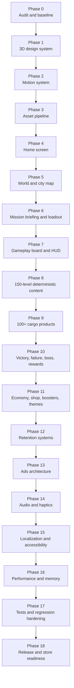

# CARGame 3D Production Roadmap

## Product destination

A production-ready Flutter cargo sorting game with 150 levels, 6 worlds, 25 cities per world, complete 3D-rendered visual language, responsive motion, offline-first progression, safe economy, Arabic/English support, and Android release readiness.

## Visual roadmap

## Execution rule

Codex must always continue from the first incomplete phase in `docs/STATUS.md`. Each phase ends only when code, documentation, tests, analysis, and the applicable Android build are complete and committed.

---

## Phase 0 — Repository audit and baseline

Deliverables:

- Map current architecture, screens, storage keys, scripts, packages, assets, and tests.
- Identify duplicate scripts, startup risks, navigation races, overflow risks, cache issues, and missing tests.
- Record baseline command output.
- Create or update all required documentation.

Exit criteria:

- Current project compiles or all baseline blockers are documented.
- `docs/STATUS.md` names the exact next phase.

## Phase 1 — Shared 3D design system

Deliverables:

- Shared color, type, spacing, radius, gradient, shadow, depth, breakpoint, and resource components.
- Reusable 3D button, card, resource chip, badge, asset host, and screen background.
- One source of truth for visual tokens.

Exit criteria:

- No new screen-specific duplicate design primitives.
- Responsive examples and widget tests exist.

## Phase 2 — Motion system

Deliverables:

- `GameMotionTokens` for duration, curves, spring, stagger, amplitude, and reduced motion.
- Reusable animated button, resource delta, selection pop, shake, reward reveal, coin flight, star fill, screen transition, and ambient parallax components.
- Animation lifecycle policy and performance instrumentation.

Exit criteria:

- All controllers are disposed.
- Reduced-motion path exists.
- Motion tests cover completion and repeated taps.

## Phase 3 — 3D asset pipeline

Deliverables:

- Organized asset directories and manifest.
- Transparent optimized WebP conventions.
- Asset IDs, semantic labels, fallback, dimensions, category, rarity, world, and animation profile.
- Lazy loading and targeted precache.

Exit criteria:

- Missing assets never crash the app.
- Asset catalog and fallback tests pass.

## Phase 4 — Home screen

Deliverables:

- 3D hero world scene with subtle parallax and ambient motion.
- Animated hearts, coins, stars, XP, daily reward, mission, store, progress, and main CTA.
- Responsive start button for all phone and tablet sizes.

Motion requirements:

- Hero idle loop.
- Resource value interpolation and pulse.
- Start button press depth.
- Cards enter with short stagger only on first appearance.

Exit criteria:

- No overflow under large text or RTL.
- No duplicate navigation.

## Phase 5 — World and city map

Deliverables:

- 6 animated world identities.
- 25 cities per world with 3D landmarks.
- Locked, available, completed, milestone, and boss states.
- Preserved scroll position.

Motion requirements:

- Path reveal.
- City unlock burst.
- Selected city breathing highlight.
- Boss gate/chest idle motion.

Exit criteria:

- List/sliver performance remains smooth.
- Off-screen loops are paused.

## Phase 6 — Mission briefing and loadout

Deliverables:

- 3D city/boss hero.
- Objective, moves, difficulty, prior stars, rewards, and loadout.
- Smart Hint, Extra Moves, and Combo Shield selection.

Motion requirements:

- Booster selection pop and glow.
- Invalid selection shake.
- Start sequence that visually confirms selected loadout.

Exit criteria:

- Boosters are consumed only after mission start succeeds.
- Double-tap protection is verified.

## Phase 7 — Gameplay board and HUD

Deliverables:

- 3D cargo, crates, shelves/slots, board depth, HUD resources, pause, and boosters.
- Clear state machine for idle, resolving, won, lost, paused, and navigating.

Motion requirements:

- Pickup response under 100 ms.
- Curved sorting trajectory.
- Placement squash/bounce.
- Correct sparkle, wrong recoil, combo escalation, board settle.
- Motion, sound, and haptics synchronized.

Exit criteria:

- No action accepted while board is resolving.
- Win/loss cannot trigger twice.
- Stable frame pacing on target devices.

## Phase 8 — 150 deterministic levels

Deliverables:

- Six world rule sets.
- Difficulty curve and deterministic level generator/configuration.
- Tutorial, standard, milestone, challenge, and boss level types.
- Boss mechanics that differ from ordinary levels.

Exit criteria:

- Levels 1, 5, 25, 26, 50, 100, 125, and 150 have explicit tests.
- All generated levels are solvable or validated by rules.

## Phase 9 — 100+ 3D cargo products

Deliverables:

- Product categories, rarity, size/weight class, stable ID, asset, semantic label, animation profile, and sound profile.
- Products used in actual levels.

Exit criteria:

- No emoji or Material product placeholders remain.
- Duplicate silhouettes are minimized.

## Phase 10 — Victory, failure, boss, and rewards

Deliverables:

- 3D result presentation.
- Stars, XP, coins, boosters, milestone rewards, world chest, Next, Replay, and Map.

Motion requirements:

- Star sequence.
- Coin flight to wallet.
- XP interpolation.
- Chest opening.
- Boss/world sequence skippable after first view.

Exit criteria:

- Rewards grant exactly once.
- Navigation actions are guarded and non-blocking.

## Phase 11 — Economy, shop, boosters, and themes

Deliverables:

- Transaction-safe coins, hearts, boosters, themes, and purchase history.
- 3D store cards and confirmations.

Motion requirements:

- Purchase success burst.
- Insufficient balance shake.
- Resource transfer animation.

Exit criteria:

- Balances never become negative.
- Repeated taps cannot duplicate purchases.

## Phase 12 — Retention systems

Deliverables:

- Daily calendar, daily/weekly missions, achievements, streaks, mystery chest, and event-ready architecture.

Motion requirements:

- Claimable state pulse.
- Progress fill.
- Reward reveal hierarchy based on rarity.

Exit criteria:

- Date transitions and repeat claims are tested.

## Phase 13 — Ads architecture

Deliverables:

- Rewarded, interstitial, and optional banner placements.
- Debug test IDs and secure release configuration.
- Ads never block startup or gameplay state.

Exit criteria:

- Timeout/failure path continues normally.
- Reward callback is idempotent.

## Phase 14 — Audio and haptics

Deliverables:

- Music per world, UI/gameplay/reward sounds, haptic profiles, settings, and lifecycle handling.

Exit criteria:

- Audio and haptics align with motion intensity.
- Disabled settings are respected immediately.

## Phase 15 — Localization and accessibility

Deliverables:

- All strings in ARB.
- Arabic RTL and English LTR.
- Semantics for assets and controls.
- Reduced motion, scalable text, contrast, and safe targets.

Exit criteria:

- No hard-coded production strings.
- RTL and large-text tests pass.

## Phase 16 — Performance and memory

Deliverables:

- Asset sizing, targeted precache, animation throttling, rebuild reduction, controller disposal, and profiling notes.
- Performance tiers for low, medium, and high devices.

Exit criteria:

- No off-screen continuous animations.
- No known animation/controller leaks.
- Smooth core interactions on mid-range Android target.

## Phase 17 — Tests and regression hardening

Deliverables:

- Unit, widget, responsive, persistence, navigation, economy, reward, localization, and animation regression tests.
- Golden tests where stable and practical.

Exit criteria:

- Required test matrix is complete.
- Known regressions are documented or fixed.

## Phase 18 — Release and store readiness

Deliverables:

- Versioning, icon, splash, signing documentation, privacy hooks, APK, AAB, release notes, store listing checklist, and recovery scripts.

Exit criteria:

- Release builds pass.
- No secrets or local device names exist in the repository.
- Installation and first-run documentation is verified.
