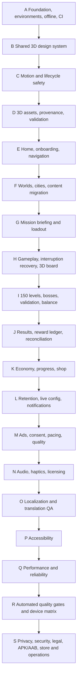

# CARGame Global Production Roadmap

## Product destination

A production-ready Flutter cargo sorting game with 150 levels, 6 worlds, 25 cities per world, a complete premium 3D-rendered visual language, responsive motion, offline-first progression, safe economy, Arabic/English support, measurable quality, privacy/security readiness, and Android store release operations.

## Execution sequence

## Cross-cutting gates

These gates are tracked in the catalog and apply across phases rather than only at the end:

- Saved-data migrations and content compatibility.
- Offline-first behavior and optional-service isolation.
- Secrets, environment configuration, dependency governance, and CI.
- Analytics/privacy gating and crash diagnostics.
- Asset/audio provenance and commercial-use rights.
- Responsive EN/AR, accessibility, reduced motion, and low-end mode.
- Idempotent rewards, purchases, ads, navigation, and recovery after interruption.
- Dashboard/catalog validation and evidence-based task status.

## Phase summary and exit focus

| Phase | Delivery focus | Primary exit gate |
|---|---|---|
| A | Baseline, architecture, persistence, environments, secrets, CI, analytics/crash boundaries, offline isolation, developer tooling | Reproducible clean-machine workflow with safe data and optional-service failure isolation. |
| B | Shared 3D tokens/components and complete UI states | Responsive reusable primitives pass tests; no competing visual system. |
| C | Shared motion, feedback, transitions, lifecycle/interruption safety | Immediate feedback, reduced motion, no leaks, safe interruption. |
| D | Typed asset registry, optimized packs, fallbacks, provenance/licensing, CI checks | Missing assets are safe; assets meet rights, format, memory, and load budgets. |
| E | Home, current journey, onboarding/resume, navigation/deep-link safety | Every entry works without overflow or duplicate navigation. |
| F | Six worlds/150 cities, unlocks, bosses, scroll restoration, content migration | Progress remains valid across map/content updates. |
| G | Accessible mission preview and atomic loadout launch | Booster/heart state changes exactly once and survives failed launch. |
| H | Deterministic gameplay, 3D board/products, pause/recovery, anti-spam state machine | Complete run remains correct through rapid input, backgrounding, and restart. |
| I | Versioned level schema, 150 validated levels, quantitative difficulty, six bosses, balancing telemetry | Every level validates/solves and content updates preserve progress. |
| J | Victory/failure, 3D rewards, transaction ledger, configured reward tables, reconciliation | Every reward has one idempotency key and survives interruption without duplication. |
| K | Versioned economy, wallet/hearts/XP/boosters, shop, audit, achievements, future sync/billing boundaries | Balances and purchases remain atomic, auditable, and migration-safe. |
| L | Daily/weekly loops, streaks, chests, events, live config, notifications, clock safeguards | Claims are time-zone/clock safe and all online/live features fail safely offline. |
| M | Rewarded/interstitial flows, secure IDs, consent, analytics, no-fill UX | Ads never block play; callbacks are idempotent and privacy-compliant. |
| N | Licensed SFX/music, haptics, settings, lifecycle, synchronized feedback | Rights and loudness are documented; settings/background behavior pass. |
| O | EN/AR localization, RTL/LTR, names, formatting, plurals, fonts, translation QA | No hard-coded user text; locale tests and fallback policy pass. |
| P | Semantics, screen reader, large text, contrast, focus, touch targets, non-color cues, reduced motion | Core journey is operable with supported accessibility settings. |
| Q | Frame/memory/startup/app-size/network/battery budgets, low-end mode, runtime/storage recovery | Representative device budgets pass without leaks or data loss. |
| R | Unit/widget/golden/integration/privacy/security/device/dashboard/smoke/soak quality gates | CI and release-candidate matrix pass with recorded evidence. |
| S | Privacy/data safety, security threat model/scans, legal notices/rights, signing, APK/AAB, listings, testing tracks, monitoring, rollback, archive, go/no-go | All P0 tasks VERIFIED and signed release/operations evidence complete. |

## Execution rule

Codex must select work from `docs/FEATURE_CATALOG.md`, not from prose alone. It must register missing work before implementation, keep one primary feature `IN PROGRESS`, update evidence and `docs/STATUS.md`, validate the dashboard parser, and stop only at a committed checkpoint. A phase is complete only when every required non-deferred feature is `VERIFIED`.
